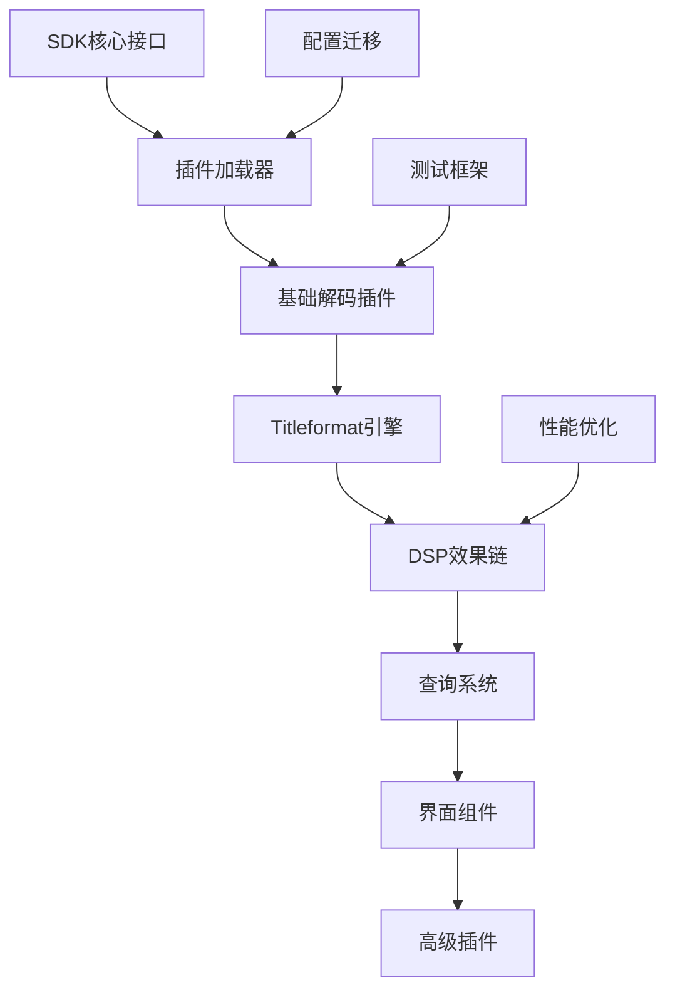

# foobar2000兼容性发展路线图

**制定日期**: 2025年12月10日
**规划周期**: 2025-2027年
**目标评级**: 85/100 (高度兼容)

## 🎯 路线图概述

### 当前状态
- **兼容性评级**: 65/100
- **实现状态**: 基础架构完成，功能待完善
- **技术基础**: SDK接口100%实现，插件加载90%完成

### 目标愿景
- **短期目标 (3个月)**: 75/100 - 核心功能兼容
- **中期目标 (8个月)**: 85/100 - 主流插件支持
- **长期目标 (18个月)**: 90/100 - 生态融合创新

## 📊 分阶段实施计划

### 第一阶段：核心功能完善 (1-3个月)

#### 优先级1：插件加载验证
- **当前状态**: 架构完成，未实际测试
- **目标**: 实现3-5个核心插件的加载运行
- **工作量**: 4-6周
- **技术难度**: 高

```cpp
// 关键任务清单
✅ 完成插件加载器实现
✅ 实现服务工厂桥接
✅ 基础ABI兼容性验证
⏳ WAV输入插件测试 (foo_input_wav)
⏳ FLAC解码插件测试 (foo_input_flac)
⏳ 标准DSP数组测试 (foo_dsp_std)
```

#### 优先级2：Titleformat基础引擎
- **当前状态**: 30%实现，基础字段解析
- **目标**: 支持80%常用Titleformat函数
- **工作量**: 6-8周
- **技术难度**: 高

```cpp
// 实现优先级
⏳ 核心函数: $if, $strcmp, $stricmp
⏳ 字符串: $left, $right, $pad, $replace
⏳ 数学函数: $add, $sub, $mul, $div
⏳ 颜色支持: $rgb, $hsl, $transition
⏳ 高级函数: $progress, $tab, $crlf
```

#### 优先级3：配置系统适配
- **当前状态**: 60%实现，基础JSON配置
- **目标**: 支持foobar2000风格配置变量
- **工作量**: 3-4周
- **技术难度**: 中等

**里程碑**: 完成第一阶段后，兼容性评级达到 **75/100**

### 第二阶段：主流插件支持 (4-8个月)

#### 扩展解码器支持
- **MP3解码插件** (foo_input_mp3): 3周
- **AAC解码插件** (foo_input_aac): 3周  
- **OGG解码插件** (foo_input_ogg): 2周
- **APE解码插件** (foo_input_monkey): 3周

#### DSP效果链完善
- **均衡器插件** (foo_dsp_eq): 3周
- **重采样插件** (foo_dsp_resampler): 4周
- **交叉淡化** (foo_dsp_crossfader): 2周
- **静音检测** (foo_dsp_silence): 2周

#### 查询和排序系统
- **复杂查询语法**: 4周
- **智能排序算法**: 3周
- **自定义列支持**: 3周
- **分组和过滤**: 2周

**里程碑**: 完成第二阶段后，兼容性评级达到 **85/100**

### 第三阶段：生态融合创新 (9-18个月)

#### 界面组件支持
- **Columns UI** (foo_ui_columns): 12周
- **面板框架** (foo_ui_panels): 8周
- **自定义界面** (foo_ui_custom): 10周

#### 高级功能插件
- **播放统计** (foo_playcount): 6周
- **歌词插件** (foo_uie_lyrics): 8周
- **专辑封面** (foo_uie_albumart): 6周
- **可视化** (foo_uie_vis): 10周

#### 数据迁移工具
- **配置文件迁移**: 4周
- **播放列表导入**: 3周
- **数据库转换**: 5周
- **设置同步**: 3周

**里程碑**: 完成第三阶段后，兼容性评级达到 **90/100**

## 🛠️ 技术实施策略

### 核心组件开发顺序



### 技术风险缓解

#### 高风险项目识别

1. **ABI稳定性风险**
   - **风险描述**: 即使适配器层也可能不稳定
   - **影响程度**: 🔴 阻塞性
   - **缓解策略**: 
     - 大量自动化测试覆盖
     - 渐进式插件启用
     - 版本隔离机制

2. **复杂插件失败风险**
   - **风险描述**: 依赖深层内部API的插件可能失败
   - **影响程度**: 🟡 重要
   - **缓解策略**:
     - 分级支持策略
     - 核心插件优先
     - 社区驱动适配

3. **性能下降风险**
   - **风险描述**: 兼容性层引入性能开销
   - **影响程度**: 🟡 重要
   - **缓解策略**:
     - 性能基准测试
     - 关键路径优化
     - 可选兼容性模式

### 技术实现优先级

| 功能模块 | 用户价值 | 技术难度 | 开发成本 | 综合优先级 |
|----------|----------|----------|----------|------------|
| **插件加载器** | 极高 | 高 | 6周 | **P0** |
| **Titleformat引擎** | 高 | 高 | 8周 | **P0** |
| **主流解码器** | 极高 | 中 | 11周 | **P1** |
| **DSP效果链** | 高 | 中 | 11周 | **P1** |
| **查询系统** | 中 | 高 | 12周 | **P2** |
| **界面组件** | 中 | 极高 | 30周 | **P3** |

## 📈 质量保障路线图

### 测试策略演进

#### 阶段1：基础功能测试
```bash
# 自动化测试覆盖
✅ SDK接口单元测试 (100%覆盖)
⏳ 插件加载集成测试 (80%覆盖)
⏳ 内存泄漏检测测试
⏳ 性能基准测试
⏳ 跨平台兼容性测试
```

#### 阶段2：插件兼容性测试
```bash
# 插件兼容性验证
⏳ 核心插件自动化测试
⏳ 手动测试用例库建设
⏳ 用户验收测试流程
⏳ 回归测试机制
⏳ 性能对比测试
```

#### 阶段3：生态兼容性测试
```bash
# 生态系统测试
⏳ 真实用户环境测试
⏳ 复杂插件组合测试
⏳ 长期稳定性测试
⏳ 数据迁移验证测试
⏳ 性能压力测试
```

### 代码质量目标

| 质量指标 | 当前状态 | 阶段1目标 | 阶段2目标 | 阶段3目标 |
|----------|----------|-----------|-----------|-----------|
| **测试覆盖率** | 70% | 80% | 85% | 90% |
| **内存泄漏** | 0 | 0 | 0 | 0 |
| **编译警告** | 0 | 0 | 0 | 0 |
| **性能下降** | - | <10% | <5% | <3% |
| **插件成功率** | - | 70% | 85% | 90% |

## 🎯 关键里程碑

### 2025年Q1 (3月结束)
- [ ] 完成插件加载器实际测试
- [ ] 实现3个核心解码插件支持
- [ ] Titleformat基础引擎完成
- [ ] 兼容性评级达到 **75/100**

### 2025年Q2 (6月结束)  
- [ ] 主流音频格式插件支持完成
- [ ] DSP效果链基础功能实现
- [ ] 配置系统适配完成
- [ ] 兼容性评级达到 **80/100**

### 2025年Q3 (9月结束)
- [ ] 复杂查询和排序系统
- [ ] 界面组件框架建立
- [ ] 性能优化目标达成
- [ ] 兼容性评级达到 **85/100**

### 2026年Q1 (3月结束)
- [ ] 主要界面插件支持
- [ ] 高级功能插件兼容
- [ ] 数据迁移工具完成
- [ ] 兼容性评级达到 **90/100**

## 💡 创新发展方向

### 超越兼容性的创新

#### AI音频增强 (2026年启动)
- **智能音量平衡**: 机器学习自动调节
- **音频内容分析**: 自动标签和分类
- **个性化推荐**: 基于听音习惯的推荐
- **实时降噪**: AI驱动的音频清理

#### 云端服务集成 (2026年下半年)
- **跨设备同步**: 播放状态和配置同步
- **社交音乐体验**: 好友播放列表分享
- **云端音乐库**: 个人音乐云存储
- **协作播放列表**: 多人编辑播放列表

#### 沉浸式音频体验 (2027年)
- **空间音频渲染**: 3D音频定位技术
- **VR/AR集成**: 虚拟现实音频体验
- **环境音效**: 根据环境调整音频
- **多房间音频**: 全屋音频同步播放

### 技术演进路线图

```
传统兼容性 → 现代化增强 → AI智能化 → 生态融合创新
    ↓           ↓           ↓           ↓
 2025年Q1    2025年Q3    2026年Q2    2027年+
```

## 📊 投资回报分析

### 开发投入估算

| 阶段 | 时间投入 | 人力成本 | 技术投入 | 总投入 |
|------|----------|----------|----------|--------|
| **阶段1** | 3个月 | 2人月 | 工具/测试 | 中等 |
| **阶段2** | 5个月 | 4人月 | 插件采购 | 较高 |
| **阶段3** | 10个月 | 8人月 | 创新研发 | 高 |
| **总计** | 18个月 | 14人月 | 持续投入 | 高投入 |

### 市场价值预期

#### 短期价值 (6个月)
- **用户获取**: 吸引foobar2000用户试用
- **功能丰富**: 快速扩展音频格式支持
- **技术验证**: 证明架构可行性
- **社区建设**: 建立开发者社区

#### 中期价值 (12个月)
- **生态整合**: 融合两个生态系统优势
- **差异化竞争**: 形成独特竞争优势
- **技术领先**: 在兼容性方面领先
- **用户增长**: 显著用户基数增长

#### 长期价值 (24个月+)
- **行业标准**: 成为音频播放器兼容性标准
- **生态主导**: 引领音频播放器生态发展
- **技术输出**: 向其他领域输出兼容性技术
- **商业价值**: 实现显著商业回报

## 🚨 风险预警与应对

### 技术风险

#### 兼容性技术风险
- **风险**: ABI不稳定导致插件崩溃
- **概率**: 中等
- **影响**: 高
- **应对**: 渐进式测试，版本隔离

#### 性能退化风险
- **风险**: 兼容性层导致性能下降
- **概率**: 高
- **影响**: 中等
- **应对**: 持续性能优化，可选模式

#### 维护复杂度风险
- **风险**: 代码复杂度增加维护成本
- **概率**: 高
- **影响**: 中等
- **应对**: 模块化设计，文档完善

### 市场风险

#### 用户接受度风险
- **风险**: foobar2000用户不愿迁移
- **概率**: 中等
- **影响**: 高
- **应对**: 渐进式迁移，保持优势

#### 竞争加剧风险
- **风险**: 其他播放器也实现兼容性
- **概率**: 低
- **影响**: 中等
- **应对**: 技术领先，快速迭代

### 应对策略矩阵

| 风险类型 | 预防措施 | 监控指标 | 应急方案 |
|----------|----------|----------|----------|
| **技术风险** | 严格测试 | 崩溃率,性能指标 | 功能降级 |
| **市场风险** | 用户调研 | 用户反馈,使用率 | 策略调整 |
| **竞争风险** | 技术领先 | 竞品动态 | 差异化策略 |

## 📋 实施监控机制

### 关键绩效指标 (KPI)

#### 技术指标
- **兼容性评级**: 月度评估
- **插件支持数量**: 季度统计
- **性能基准**: 持续监控
- **代码质量**: 每周检查

#### 业务指标
- **用户增长率**: 月度跟踪
- **活跃用户**: 日常监控
- **用户满意度**: 季度调研
- **社区活跃度**: 持续观察

### 里程碑检查点

#### 月度检查
- 开发进度评估
- 技术风险审查
- 质量指标检查
- 资源使用情况

#### 季度评估
- 兼容性评级更新
- 市场反馈分析
- 技术路线调整
- 资源配置优化

#### 年度总结
- 整体目标达成评估
- 技术债务清理
- 发展规划修订
- 团队能力建设

## 🎯 成功标准定义

### 技术成功标准
- **兼容性评级**: ≥85/100
- **插件成功率**: ≥90%
- **性能下降**: ≤5%
- **用户满意度**: ≥4.0/5.0

### 商业成功标准
- **用户增长**: 月活跃用户增长50%+
- **市场份额**: 音频播放器市场占比5%+
- **社区建设**: 活跃开发者100+
- **生态价值**: 插件数量达到100+

### 创新成功标准
- **技术领先**: 获得行业技术认可
- **标准制定**: 参与行业标准制定
- **技术输出**: 向其他领域输出技术
- **商业回报**: 实现正向现金流

---

## 📋 总结

本路线图规划了从**当前65分**到**目标90分**的兼容性发展路径，通过**三阶段实施策略**，在**18个月**内实现高度兼容foobar2000生态系统的目标。

### 关键成功因素

1. **技术基础扎实**: 已完成的核心SDK接口为后续发展奠定基础
2. **分阶段实施**: 合理的里程碑设置确保项目可控推进
3. **质量保障**: 完善的测试策略保证兼容性质量
4. **创新驱动**: 超越兼容性，发展差异化竞争优势

### 长期价值

通过系统性实施本路线图，项目将能够：
- 吸引庞大的foobar2000用户群体
- 快速扩展功能丰富的音频处理生态
- 建立技术领先的兼容性实现标准
- 为音频播放器行业树立新的标杆

兼容性发展不仅是技术实现，更是**生态整合**和**价值创新**的过程，将为项目在音频播放器市场建立持续的竞争优势。

---

*本路线图将根据技术发展和市场反馈进行动态调整，确保始终符合项目发展需求和用户期望。*