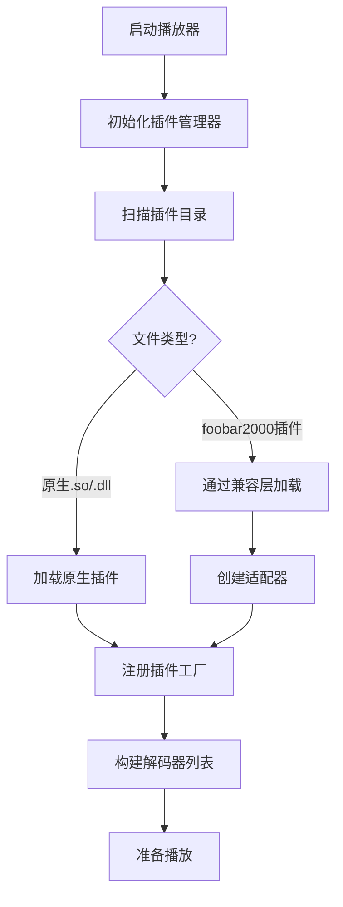

# Qoder foobar 插件架构设计方案

## 📋 当前问题分析

当前设计的问题：
1. **SDK耦合**: 原生功能与foobar2000兼容层混合
2. **接口混淆**: service_base接口直接继承自foobar2000
3. **扩展性差**: 难以支持其他播放器插件格式
4. **维护困难**: 两套逻辑交织在一起

---

## 🎯 推荐架构：分层设计

```
┌─────────────────────────────────────────────┐
│                应用层                        │
│         Qoder foobar Music Player           │
└─────────────────┬───────────────────────────┘
                  │
┌─────────────────▼───────────────────────────┐
│              插件管理器                      │
│    • 插件生命周期管理                       │
│    • 插件注册表                            │
│    • 插件加载/卸载                         │
└─────────────────┬───────────────────────────┘
                  │
┌─────────────────▼───────────────────────────┐
│           插件适配器层                      │
│                                           │
│  ┌─────────────┐  ┌─────────────────────┐   │
│  │ 原生插件适配 │  │ foobar2000兼容适配   │   │
│  │ 器          │  │ 器                  │   │
│  │             │  │                     │   │
│  │ ┌─────────┐ │  │ ┌─────────────────┐ │   │
│  │ │Audio    │ │  │ │ foobar2000 SDK  │ │   │
│  │ │Decoder  │ │  │ │ 兼容层          │ │   │
│  │ │Plugin   │ │  │ │                 │ │   │
│  │ │API      │ │  │ └─────────────────┘ │   │
│  │ └─────────┘ │  │                     │   │
│  │             │  │ ┌─────────────────┐ │   │
│  │ ┌─────────┐ │  │ │Plugin           │ │   │
│  │ │DSP      │ │  │ │Wrapper          │ │   │
│  │ │Plugin   │ │  │ │                 │ │   │
│  │ │API      │ │  │ └─────────────────┘ │   │
│  │ └─────────┘ │  │                     │   │
│  └─────────────┘  └─────────────────────┘   │
└─────────────────┬───────────────────────────┘
                  │
┌─────────────────▼───────────────────────────┐
│            Qoder foobar SDK                 │
│  • 核心接口定义                            │
│  • 插件基类                                │
│  • 工具函数                                │
└─────────────────────────────────────────────┘
```

---

## 🏗️ 第一层：Qoder foobar 原生SDK

### 核心接口设计

```cpp
// qoder_plugin_sdk.h
#pragma once

#include <cstdint>
#include <string>
#include <vector>
#include <memory>

namespace qoder {

// 插件信息结构
struct PluginInfo {
    std::string name;
    std::string version;
    std::string author;
    std::string description;
    uint32_t api_version;
};

// 音频格式
struct AudioFormat {
    int sample_rate;
    int channels;
    int bits_per_sample;
    bool is_float;
};

// 音频缓冲区
struct AudioBuffer {
    float* data;
    int frames;
    int channels;
};

// 插件基类
class IPlugin {
public:
    virtual ~IPlugin() = default;

    // 插件生命周期
    virtual bool initialize() = 0;
    virtual void finalize() = 0;

    // 获取插件信息
    virtual PluginInfo get_info() const = 0;
};

// 输入解码器接口
class IAudioDecoder : public IPlugin {
public:
    virtual ~IAudioDecoder() = default;

    // 格式支持
    virtual bool can_decode(const std::string& file_path) = 0;
    virtual std::vector<std::string> get_supported_extensions() = 0;

    // 解码操作
    virtual bool open(const std::string& file_path) = 0;
    virtual int decode(AudioBuffer& buffer, int max_frames) = 0;
    virtual bool seek(int64_t sample_pos) = 0;
    virtual void close() = 0;

    // 音频信息
    virtual AudioFormat get_format() const = 0;
    virtual int64_t get_length() const = 0;
    virtual std::string get_metadata(const std::string& key) = 0;
};

// DSP效果器接口
class IDSPProcessor : public IPlugin {
public:
    virtual ~IDSPProcessor() = default;

    // 处理配置
    virtual bool configure(const AudioFormat& input_format,
                          const AudioFormat& output_format) = 0;

    // 处理音频
    virtual int process(const AudioBuffer& input,
                       AudioBuffer& output) = 0;

    // 参数控制
    virtual void set_parameter(const std::string& name, double value) = 0;
    virtual double get_parameter(const std::string& name) = 0;
};

// 输出设备接口
class IAudioOutput : public IPlugin {
public:
    virtual ~IAudioOutput() = default;

    // 设备管理
    virtual std::vector<std::string> get_devices() = 0;
    virtual bool open_device(const std::string& device_id,
                            const AudioFormat& format) = 0;
    virtual void close_device() = 0;

    // 音频输出
    virtual int write(const AudioBuffer& buffer) = 0;
    virtual int get_latency() = 0;
    virtual void flush() = 0;
};

// 插件工厂
template<typename Interface>
class IPluginFactory {
public:
    virtual ~IPluginFactory() = default;
    virtual std::unique_ptr<Interface> create() = 0;
    virtual PluginInfo get_info() const = 0;
};

// 插件导出宏
#define QODER_EXPORT_PLUGIN(PluginClass, FactoryClass) \
    extern "C" { \
        QODER_PLUGIN_API IPluginFactory* create_plugin_factory() { \
            return new FactoryClass(); \
        } \
    }

} // namespace qoder
```

### 插件示例

```cpp
// flac_decoder_plugin.cpp
#include "qoder_plugin_sdk.h"

class FLACDecoderPlugin : public qoder::IAudioDecoder {
private:
    // FLAC解码器内部状态

public:
    bool initialize() override {
        // 初始化FLAC库
        return true;
    }

    void finalize() override {
        // 清理资源
    }

    qoder::PluginInfo get_info() const override {
        return {
            "FLAC Decoder",
            "1.0.0",
            "Qoder Team",
            "FLAC lossless audio decoder",
            QODER_PLUGIN_API_VERSION
        };
    }

    bool can_decode(const std::string& file_path) override {
        // 检查文件是否为FLAC
        return file_path.ends_with(".flac");
    }

    // ... 其他接口实现
};

class FLACDecoderFactory : public qoder::IPluginFactory<qoder::IAudioDecoder> {
public:
    std::unique_ptr<qoder::IAudioDecoder> create() override {
        return std::make_unique<FLACDecoderPlugin>();
    }

    qoder::PluginInfo get_info() const override {
        return {
            "FLAC Decoder Factory",
            "1.0.0",
            "Qoder Team",
            "Factory for FLAC decoder plugin",
            QODER_PLUGIN_API_VERSION
        };
    }
};

// 导出插件
QODER_EXPORT_PLUGIN(FLACDecoderPlugin, FLACDecoderFactory)
```

---

## 🔄 第二层：foobar2000 兼容适配器

### 适配器设计

```cpp
// foobar_adapter.h
#pragma once

#include "../qoder_plugin_sdk.h"
#include "foobar2000.h"
#include <unordered_map>

namespace qoder::compat {

// foobar2000 到 Qoder 接口的适配器
class FoobarDecoderAdapter : public qoder::IAudioDecoder {
private:
    foobar2000::service_ptr_t<foobar2000::input_decoder> foobar_decoder_;
    std::string file_path_;

public:
    explicit FoobarDecoderAdapter(foobar2000::input_decoder* decoder)
        : foobar_decoder_(decoder) {}

    // 实现 Qoder 接口
    bool can_decode(const std::string& file_path) override {
        return foobar_decoder_->can_decode(file_path.c_str());
    }

    bool open(const std::string& file_path) override {
        file_path_ = file_path;
        return foobar_decoder_->open(file_path.c_str()) == 0;
    }

    int decode(qoder::AudioBuffer& buffer, int max_frames) override {
        // 转换缓冲区格式
        return foobar_decoder_->decode(buffer.data, max_frames * sizeof(float));
    }

    // ... 其他适配方法
};

// foobar2000 插件包装器
class FoobarPluginWrapper {
private:
    void* library_handle_;
    std::vector<std::unique_ptr<qoder::IAudioDecoder>> adapters_;

public:
    bool load_plugin(const std::string& path) {
        // 加载foobar2000插件
        library_handle_ = dlopen(path.c_str(), RTLD_LAZY);
        if (!library_handle_) return false;

        // 枚举插件提供的服务
        enumerate_services();

        return true;
    }

    std::vector<std::unique_ptr<qoder::IAudioDecoder>> get_decoders() {
        // 返回适配后的解码器
        std::vector<std::unique_ptr<qoder::IAudioDecoder>> result;
        for (auto& adapter : adapters_) {
            result.emplace_back(std::move(adapter));
        }
        return result;
    }
};

} // namespace qoder::compat
```

---

## 🎛️ 第三层：插件管理器

### 统一插件管理

```cpp
// plugin_manager.h
#pragma once

#include "qoder_plugin_sdk.h"
#include "compat/foobar_adapter.h"
#include <vector>
#include <unordered_map>
#include <memory>

namespace qoder {

class PluginManager {
private:
    // 原生插件
    std::unordered_map<std::string, std::unique_ptr<IPluginFactory>> native_plugins_;

    // foobar2000插件
    std::vector<std::unique_ptr<compat::FoobarPluginWrapper>> foobar_plugins_;

    // 注册的解码器
    std::vector<std::unique_ptr<IAudioDecoder>> decoders_;

public:
    // 加载原生插件
    bool load_native_plugin(const std::string& path);

    // 加载foobar2000插件
    bool load_foobar_plugin(const std::string& path);

    // 批量加载
    void load_plugins_from_directory(const std::string& directory);

    // 获取解码器
    std::unique_ptr<IAudioDecoder> get_decoder(const std::string& file_path);

    // 获取所有支持的格式
    std::vector<std::string> get_supported_formats();

    // 插件信息
    std::vector<PluginInfo> get_plugin_list();
};

} // namespace qoder
```

---

## 📁 目录结构

```
Qoder_foobar/
├── sdk/                         # Qoder foobar 原生SDK
│   ├── qoder_plugin_sdk.h      # 核心接口定义
│   ├── qoder_plugin_api.h      # 平台相关定义
│   └── examples/               # 插件示例
│       ├── simple_decoder/
│       └── dsp_plugin/
├── compat/                      # 兼容层
│   ├── foobar2000/             # foobar2000兼容
│   │   ├── foobar_adapter.h   # 适配器头文件
│   │   ├── foobar_adapter.cpp # 适配器实现
│   │   └── foobar_sdk/        # foobar2000 SDK副本
│   └── other_players/          # 其他播放器兼容(未来)
├── core/                        # 核心系统
│   ├── plugin_manager.h       # 插件管理器
│   ├── plugin_manager.cpp     #
│   └── plugin_registry.h      # 插件注册表
└── src/                         # 主程序
    └── music_player.cpp        # 使用新SDK的音乐播放器
```

---

## 🔄 插件加载流程



---

## 🎯 优势

1. **清晰的职责分离**
   - 原生SDK独立于任何播放器
   - 兼容层是可选的适配器
   - 插件管理器统一管理

2. **易于扩展**
   - 添加新的兼容层不需要修改SDK
   - 可以支持多种插件格式
   - 插件开发者只需关注原生接口

3. **更好的性能**
   - 原生插件零开销
   - 兼容层只在需要时加载
   - 减少不必要的转换

4. **维护性好**
   - 各层独立开发和测试
   - 兼容层问题不影响核心功能
   - 便于定位和修复问题

---

## 📝 实施建议

1. **第一阶段**: 实现原生SDK
   - 定义核心接口
   - 创建示例插件
   - 实现插件管理器

2. **第二阶段**: 迁移现有功能
   - 将现有解码器改为原生插件
   - 更新音乐播放器使用新SDK

3. **第三阶段**: 实现兼容层
   - 开发foobar2000适配器
   - 测试兼容性

4. **第四阶段**: 优化和扩展
   - 性能优化
   - 添加其他播放器兼容
   - 完善文档

---

*这个设计让Qoder foobar既有了强大的原生插件能力，又保持了对foobar2000生态的兼容性。*